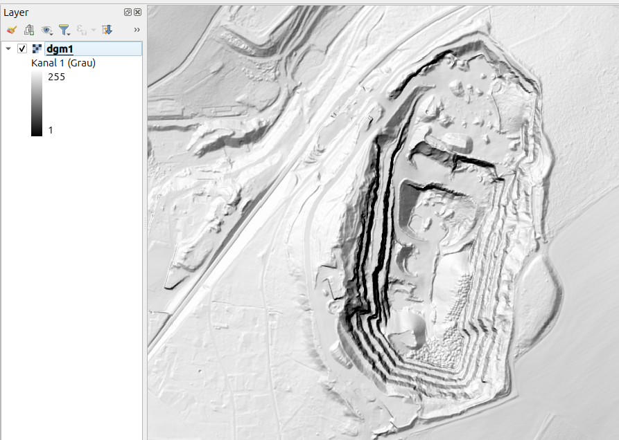

# DGM1 Sachsen – Automatisierte Verarbeitungspipeline

Dieses Projekt bietet eine vollautomatische Shell-Pipeline zur Verarbeitung des **Digitalen Geländemodells 1 (DGM1)** für den Freistaat Sachsen. Es umfasst das Extrahieren, Konvertieren, Importieren, Rasterisieren und Visualisieren von Höhendaten mithilfe von **PostGIS** und **GDAL**.

## Features

* Automatischer Datenimport aus `.zip`-Dateien
* Konvertierung von XYZ nach CSV + VRT
* Laden in PostgreSQL/PostGIS
* Rasterisierung der Punktdaten (1m Auflösung)
* Erzeugung von Hillshade-Darstellungen (Schummerungen)
* TIF-Komprimierung und Overviews
* Parallele Verarbeitung via GNU Parallel
* Erstellung einer VRT-Datei als Mosaik für QGIS

---

## Verzeichnisstruktur

```bash
/bigdata/
├── import/sn/dgm1_sn/       # Eingangsdaten (.zip mit .xyz)
├── work/dgm1_sn/            # Temporäre Arbeitsdaten
└── export/dgm1_sn/          # Ausgabe: TIF, Hillshade, Pyramiden
```

---

## Voraussetzungen

* **PostgreSQL mit PostGIS-Erweiterung**
* **GDAL** (inkl. `ogr2ogr`, `gdal_rasterize`, `gdaldem`, `gdal_translate`, `gdaladdo`)
* **GNU Parallel**
* **JQ**
* Eine vorbereitete SQL-Datei: `create_dgm1_sn.sql`

---

## Konfiguration (Variablen im Skript)

```bash
export dbname="dgm1_sn"
export dbport=5432
export dbuser="postgres"
export dbtable="dgm1_sn_import"
export dgm1_sn_import="/bigdata/import/sn/dgm1_sn/dgm1_sn_import.log"
```

---

## Ablauf der Verarbeitung

1. **Vorbereitung**

   * Leeren der Verzeichnisse
   * Zurücksetzen der Datenbank

2. **ZIP-Dateien verarbeiten**
   Für jede Datei:

   * Entpacken
   * `.xyz` → `.csv` (mit Komma-Trennung)
   * Erstellung einer `.vrt`-Datei pro CSV

3. **Import in PostgreSQL/PostGIS**

   * Über `ogr2ogr` mit VRT-Dateien

4. **Rasterisierung**

   * 1m Auflösung aus Punktdaten
   * Bounding Box automatisch berechnet

5. **Hillshade-Erstellung**

   * mit `gdaldem hillshade`

6. **GeoTIFF-Optimierung**

   * Kompression + Tiling

7. **Pyramiden (Overviews)**

   * Für schnelle Darstellung in GIS-Software

8. **Bereinigung**

   * Entfernen temporärer Daten
   * Entfernen von Zwischen-TIFFs

9. **Mosaik-Erstellung**

   * Erzeugung einer `.vrt` aus allen kleinen TIF-Dateien

---

## Nutzung

### Schritt 1: Eingangsdaten bereitstellen

Lege deine `.zip`-Dateien mit XYZ-Dateien in folgendes Verzeichnis:

```bash
/bigdata/import/sn/dgm1_sn/
```

### Schritt 2: Skript ausführen

```bash
bash create_dgm1_sn.sh
```

> Stelle sicher, dass das Skript ausführbar ist:
>
> ```bash
> chmod +x create_dgm1_sn.sh
> ```

---

## Beispiel: Ausgabe-Dateien

* `/bigdata/export/dgm1_sn/small_*.tif` – optimierte Hillshade-TIFFs
* `/bigdata/export/dgm1_sn/dgm1.vrt` – Mosaik aller Einzel-TIFFs

Diese Dateien können direkt in QGIS oder ArcGIS geladen werden.

---

## Beispiel-Ausgabe in QGIS



---

## Verwendetes Setup

| Komponente       | Spezifikation                          |
|------------------|----------------------------------------|
| CPU              | Intel Core i7-8700K (6 Kerne)          |
| RAM              | 61 GB DDR4 @ 3000 MHz                  |
| Speicher         | 1 TB SSD                               |
| Betriebssystem   | Ubuntu 25.04                           |
| Virtualisierung  | VMware Workstation                     |
| Datenbank        | PostgreSQL 17.5                        |
| Geodaten-Tool    | GDAL 3.12.0dev-1ba54d7f8a              |


## Zahlen

| Kategorie     | Wert / Beschreibung                        |
|---------------|--------------------------------------------|
| Datenmenge    | 89 GB (gepackt), ca. 1 TB (entpackt)       |
| Datenformat   | CSV, XYZ                                   |
| Laufzeit      | 17,5 Stunden (mit Parallelisierung)        |
| Ergebnismenge   | 8,9 GB TIF- u. OVR-Dateien, 1xVRT-Datei                |


## Hinweise

* Koordinatensystem: **ETRS89 / UTM Zone 33N (EPSG:25833)**
* Die ursprünglichen XYZ-Dateien enthalten die Spalten: `X Y Z`
* Rasterisierung verwendet Z-Werte (Höhe)

---

## 📌 Lizenz & Nutzung

Die Nutzung der Geodaten richtet sich nach den aktuellen Bedingungen des GeoSN. Bitte informiere dich direkt auf der Hauptseite oder im Datenbereich über die jeweils gültigen Lizenzregelungen:

👉 [GeoSN Geodaten-Portal](https://www.geodaten.sachsen.de/)

👉 [Allgemeine Nutzungsbedingungen](https://www.landesvermessung.sachsen.de/allgemeine-nutzungsbedingungen-8954.html)

DGM1-Daten (XYZ als `.zip`-Pakete) können über das offizielle Geoportal Sachsen bezogen werden:
  [https://www.geodaten.sachsen.de/batch-download-4719.html](https://www.geodaten.sachsen.de/batch-download-4719.html)

**Quelle: GeoSN, [dl-de/by-2-0](https://www.govdata.de/dl-de/by-2-0)**